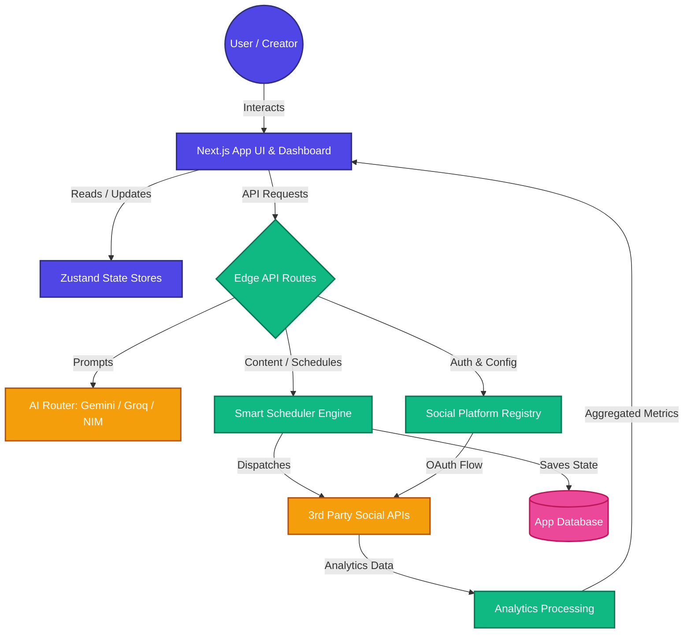

<div align="center">

# 🚀 Crevo
**The Ultimate Creator Operating System**

A unified, full-stack platform designed to supercharge content creators. Blending powerful social media management, multi-platform scheduling, deep analytics, and AI copilots into a single cutting-edge **Next.js** monolith.

[](https://nextjs.org/)
[](https://www.typescriptlang.org/)
[](https://tailwindcss.com/)
[](https://reactjs.org/)
[](https://opensource.org/licenses/MIT)

[Features](#-key-features) • [Architecture](#-system-architecture) • [Installation](#-getting-started) • [Modules](#-module-breakdown) • [Contributing](#-contributing)

</div>

---

## ✨ Key Features

| 🧠 **Integrated AI Copilots** | 📅 **Smart Multi-Scheduler** |
| :--- | :--- |
| Generate content effortlessly using **NVIDIA NIM**, **Groq**, or **Google Gemini**. Features one-click quick actions for captions, hashtags, and script hooks directly inside your dashboard. | Write once, post everywhere. Support for 18+ social platforms with automatic character limits, media validation, and intelligent peak-time posting suggestions. |

| 📊 **Advanced Analytics Engine** | 🔌 **Direct OAuth Connectors** |
| :--- | :--- |
| Track user demographics, engagement rates, and follower growth across Twitter/X, Instagram, and LinkedIn in beautifully designed, real-time interactive charts. | Secure backend routing and token management. Securely connect and manage callbacks for all your social media platforms without leaving the app. |

---

## 🏗 System Architecture

The application is structured to handle high-performance API routing and edge functions to process content and AI requests concurrently.



---

## 📂 Module Breakdown

The monolithic architecture is heavily modularized for scalability and easy maintenance.

<details>
<summary><b>Click to expand project structure</b></summary>

- 📁 **`app/`** — *Next.js App Router.* Contains the main dashboard layouts, frontend pages, and Edge API endpoints (`/api/oauth`, etc.).
- 📁 **`components/`** — *UI Primitives & Sections.* Powered by Radix UI & shadcn/ui. Contains the specific dashboard zones (Analytics, AI Copilot, Calendar).
- 📁 **`lib/`** — *Core Business Logic.* Contains definitions for the social platform capabilities (`providers.ts`), scheduling algorithms (`scheduler.ts`), and database utilities.
- 📁 **`stores/`** — *State Management.* Zustand stores (`auth-store.ts`, `platform-store.ts`, etc.) to keep the UI deeply decoupled from prop-drilling.
- 📁 **`hooks/`** — *React Hooks.* Custom logic for handling media uploads, specific theme detections, and chart state.
</details>

---

## 🚀 Getting Started

Follow these instructions to get a copy of the project up and running on your local machine for development and testing.

### 1. Prerequisites
- **Node.js** (v18.0.0 or higher)
- **pnpm** (recommended) or **npm**
- **Git**

### 2. Installation
Clone the repository to your local machine:
```bash
git clone https://github.com/sru-codes/Crevo.git
cd Crevo
```

Install the project dependencies:
```bash
pnpm install
```

### 3. Environment Configuration
Create a `.env.local` file by copying the provided example template. Make sure to populate the variables with your actual API keys.
```bash
cp .env.example .env.local
```

> **Note:** For the AI Copilot to function, ensure at least one AI provider key (e.g., `GEMINI_API_KEY`) is populated.

### 4. Running the Development Server
Start the frontend development server:
```bash
pnpm dev
```
Navigate to `http://localhost:3000` to view the dashboard.

---

## 🛠 Technology Stack

* **Frontend:** Next.js 15, React 19, Tailwind CSS, shadcn/ui, Zustand, Lucide Icons, Recharts
* **Backend:** Next.js API Routes (Edge & Node runtime)
* **AI Integration:** Google Gemini, Groq, NVIDIA NIM
* **Tooling:** TypeScript, ESLint, Prettier, PostCSS

---

## 🤝 Contributing

We love open-source and welcome contributions! Whether it's adding a new platform provider, improving the UI, or fixing bugs.

### Contribution Workflow:
1. **Fork** the repository.
2. **Create** your Feature Branch (`git checkout -b feature/AmazingFeature`).
3. **Commit** your Changes (`git commit -m 'Add some AmazingFeature'`).
4. **Push** to the Branch (`git push origin feature/AmazingFeature`).
5. **Open** a Pull Request.

> Please ensure your code follows the existing style, uses TypeScript strongly, and doesn't break the existing build pipeline (`pnpm build`).

---

## 📄 Support & License

* **License:** This project is licensed under the MIT License - see the LICENSE file for details.
* **Issues:** If you encounter any bugs or have a feature request, please [open an issue](https://github.com/sru-codes/Crevo/issues).

<div align="center">
  <i>Built with ❤️ for modern content creators.</i>
</div>
